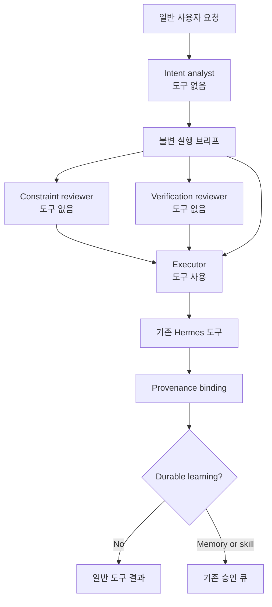

# ROKA-Agent

한국어 | [English](README.md)

ROKA-Agent는 [Hermes Agent](https://github.com/NousResearch/hermes-agent)를
기반으로 만든 **의도 보존형 실행 제어 프로파일**입니다.

> 관측은 중앙에, 판단은 말단에, 의도는 양쪽에 복제한다.

사용자는 평소처럼 자연어로 요청합니다. ROKA는 그 요청을 하나의 실행
브리프로 컴파일하고, 도구가 없는 세 개의 독립 참모 컨텍스트에서 검토한
뒤, 같은 브리프와 검토 결과를 하나의 도구 사용 executor에게 전달합니다.
메모리와 스킬 변경은 조용한 자기수정이 아니라 검토 가능한 제안으로
다룹니다.

ROKA는 Hermes의 세션, 도구, 모델 라우팅, 메모리, 스킬, 승인 저장소를
대체하지 않습니다. 첫 번째 설계 원칙은 **바퀴를 다시 만들지 않는다**입니다.
이미 있는 Hermes 기능의 가장 작은 제어 지점을 조정합니다.

## 발상 배경

ROKA는 처음에 서로 멀어 보이는 두 흐름의 구조적 유사성에서 출발했습니다.
하나는 현대 군 지휘체계의 발전이고, 다른 하나는 LLM 하네스 엔지니어링의
발전입니다.

군 전술체계는 단순 명령에서 더 풍부한 명령 페이로드로 발전했습니다.
상황 보고, METT-TC식 맥락, 9-Line 형식, 임무형 지휘, C4I, 그리고 CJADC2
같은 데이터 중심 합동 지휘 개념으로 이어집니다. 이 흐름의 핵심은 단순히
"더 많이 통제한다"거나 "더 많이 자율화한다"가 아닙니다. 보는 자와
행하는 자는 필연적으로 분리되고, 그 분리를 버티게 만드는 것은 통제도
방임도 아니라 **의도, 맥락, 제약의 사전 이식**입니다.

LLM 에이전트도 비슷한 방향으로 움직였습니다. 단순 프롬프트에서 구조화
프롬프트로, 도구 정책과 메모리, RAG, 그리고 여러 모델을 조합하는
오케스트레이션으로 확장되었습니다. 그냥 긴 프롬프트는 너무 많은 것을
암묵지로 남긴 짧은 명령과 비슷합니다. 맥락만 잔뜩 넣는 것은 의도 없는
상황판과 비슷합니다. 공유된 의도 없이 자율성만 커진 에이전트는 국지적으로
똑똑하지만 전체 목적에는 취약해집니다.

그래서 ROKA의 출발 질문은 이것이었습니다.

> LLM 제어 루프가 사용자의 요청을 raw prompt가 아니라 intent package로
> 취급한다면 어떤 구조가 되어야 하는가?

ROKA의 현재 답은 다음 실행 패턴입니다.

- 사용자의 일반 요청을 하나의 불변 실행 브리프로 컴파일한다.
- 관측, 제약 검토, 검증 판단을 도구 없는 독립 참모 컨텍스트에 분리한다.
- 실제 행동은 하나의 도구 사용 executor에게만 맡긴다.
- 과업, 목적, 제약, 가정, 이탈 규칙, 자율 정책, 검토 정책을 매 실행
  반복에서 유지한다.
- 참모가 비었거나 실패했거나 호출되지 않았으면 성공처럼 꾸미지 않고
  degraded state로 드러낸다.

이 비유는 ROKA의 탄생 배경을 설명하기 위한 것입니다. 실제 런타임 용어는
군사용어를 전면에 내세우지 않고 Hermes의 기존 개념을 사용합니다. 즉 MoA
preset, reference model, tool, memory, skill, approval gate, provider routing을
재사용해서 제어 구조를 만듭니다.

## 릴리즈 상태

**v0.1.0 released.** 런타임 제어 경로는 구현되어 있고, ROKA 전용 테스트와
상류 Hermes 회귀 테스트로 검증했습니다. 실제 네 개 모델/provider 실행은
운영자가 Codex 및 OpenRouter 자격 증명을 설정해야 합니다. 릴리즈는
자격 증명을 포함하거나 몰래 대체하지 않습니다.

구현된 것:

- 일반 사용자 메시지를 실행 브리프로 자동 컴파일
- CLI와 Gateway의 `/moa` 턴을 같은 virtual MoA control facade로 진입
- 세 개의 격리된 advisor role과 하나의 도구 사용 executor
- 한 사용자 턴 전체에서 유지되는 안정적인 brief
- role별 logical session ID와 provider/model provenance
- 실제 fallback route 라벨, accounting, executor provenance 기록
- 각 실행 반복마다 constraint review와 verification review 수행
- advisor 미가용 시 loud degraded-mode 보고
- 단일 acting executor 유지, 새 `delegate_task` subagent spawn 차단
- ROKA 범위의 memory/skill write approval gate
- pending write의 fail-closed 저장 및 ID 검증
- durable learning은 evidence가 있을 때만 제안
- 외부 model fallback이 ROKA facade를 우회하지 못하도록 fail-closed 보호

ROKA는 보안 sandbox도 아니고, bit-for-bit 결정론적 런타임도 아니며, LLM이
의도를 완벽히 복구한다는 주장도 아닙니다. 코드가 강제하는 경계는 아래
[제어 경계](#제어-경계)에 명시되어 있습니다.

## 런타임 흐름



intent analyst가 먼저 실행됩니다. 다른 역할들은 정확히 같은 실행 브리프를
받아야 하기 때문입니다. constraint reviewer와 verification reviewer는 그
뒤 독립적으로 실행됩니다. 도구 정의를 받는 것은 executor뿐입니다.

| Role | 기본 route | 책임 |
| --- | --- | --- |
| `intent_analyst` | `openai-codex:gpt-5.5` | 요청을 task, purpose, constraints, assumptions, review rules로 변환 |
| `constraint_reviewer` | `openrouter:deepseek/deepseek-v4-pro` | scope expansion, unsafe assumption, conflicting constraint, missing authority 탐지 |
| `verification_reviewer` | `openrouter:google/gemini-3-pro-preview` | completion claim 전에 evidence, test, repeatability 요구 |
| `executor` | `openrouter:anthropic/claude-opus-4.8` | 브리프와 검토 결과에 따라 Hermes 도구를 사용해 실행 |

이 모델들은 기본값일 뿐 하드 의존성이 아닙니다. `roka` MoA preset에서
provider/model은 바꿀 수 있지만, 세 개의 고유한 `advisor_role` 값은 보존해야
합니다. Hermes가 fallback route를 사용하면 ROKA는 설정된 route가 아니라
실제로 응답한 provider/model을 별도로 기록합니다.

## 빠른 시작

fork를 clone하고 설치합니다.

```bash
git clone https://github.com/EESIZ/ROKA-Agent.git
cd ROKA-Agent
python -m pip install -e .
hermes setup
```

Windows에서는 기존 Hermes PowerShell installer를 사용할 수 있습니다.
`ROKA-Agent` checkout 안에서 실행해야 별도 upstream checkout이 생기지
않습니다.

```powershell
Set-ExecutionPolicy -Scope Process Bypass
.\scripts\install.ps1 -InstallDir (Get-Location).Path
```

기본 프로파일은 intent analyst에 Codex 인증을, 나머지 모델에는 OpenRouter
API key를 사용합니다. 둘 다 일반 Hermes setup 흐름에서 설정합니다.

ROKA 세션 시작:

```bash
hermes chat --provider moa --model roka
```

그 뒤에는 평소처럼 자연어 요청을 입력하면 됩니다. JSON이나 특수 명령
패킷을 직접 쓸 필요가 없습니다.

일반 Hermes 세션 안에서 한 턴만 ROKA 제어로 실행하려면:

```text
/moa <your ordinary request>
```

## 실행 브리프

실제 사용자 턴마다 하나의 brief가 만들어집니다.

```json
{
  "brief_id": "brief_...",
  "task": "what must be done",
  "purpose": "why the result matters",
  "constraints": ["boundaries that must not be crossed"],
  "assumptions": ["premises currently treated as true"],
  "deviation_rule": "when and how the executor may depart",
  "autonomy_policy": "what may proceed without another question",
  "review_policy": "what evidence is required before completion"
}
```

intent model이 실패하거나 malformed output을 반환하면, ROKA는 memory,
retrieval, plugin context가 주입되기 전의 clean user request를 바탕으로
보수적인 fallback brief를 만듭니다. 제어 계층을 조용히 생략하지 않습니다.
같은 `brief_id`는 한 사용자 턴의 모든 도구 반복에서 유지되고, 다음 사용자
메시지에서 변경됩니다.

각 모델 호출은 별도의 message list와 logical `agent_session_id`를 받습니다.
많은 provider API는 stateless이므로 여기서 "session"은 원격 provider의
서버 저장 상태가 아니라 격리된 대화 이력과 감사 ID를 뜻합니다.

## Learning Control

ROKA가 활성화되면 Hermes의 built-in `memory`와 `skill_manage` mutation path는
기존 approval gate를 통과합니다.

- Memory write는 interactive approval channel이 있으면 inline approve될 수
  있고, 없으면 staged 상태가 됩니다.
- Skill write는 behavioral impact와 diff size가 커서 항상 staged됩니다.
- Pending record에는 `brief_id`, parent/agent session ID, role, provider,
  model, task/tool call ID, risk class가 포함됩니다.
- Atomic disk write가 성공해야 staged로 보고됩니다.
- Background review는 durable evidence를 찾아야 하며, 대부분의 세션에서
  억지로 skill update를 만들도록 지시받지 않습니다.

기존 명령으로 proposal을 검토합니다.

```text
/memory pending
/memory approve <id>
/memory reject <id>
/skills pending
/skills diff <id>
/skills approve <id>
/skills reject <id>
```

## 제어 경계

런타임이 강제하는 것:

- 저장된 ROKA preset에 정확히 세 개의 enabled, unique advisor role 존재
- intent compilation 후 reviewer fan-out
- tool-free advisor call과 single tool-enabled executor
- 새 subagent spawn capability 제거
- advisor별 message history와 logical session identity 분리
- 사용자 턴마다 하나의 frozen `ExecutionBrief`
- reviewer prompt와 executor context에 같은 brief 전달
- ROKA memory/skill write의 approval routing
- 실패/미가용 role을 숨기지 않는 visible degraded label
- auxiliary fallback route 사용 시 실제 provider/model 기록

런타임이 강제할 수 없는 것:

- 모호하거나 모순된 요청의 완벽한 의미 복구
- stochastic model call의 완전히 동일한 자연어 출력
- third-party provider의 가용성, 동작, retention policy
- 외부 evidence 없는 reviewer opinion의 진실성
- executor가 모든 brief/reviewer instruction을 의미적으로 완벽히 따르는 것
- 일반 terminal/file write, 외부 memory provider retention, Hermes API를 우회하는
  third-party plugin

따라서 verification reviewer는 executor를 안내하지만, 완료의 증거는 여전히
실제 도구 결과와 테스트입니다.

## 설정

기본 `roka` preset은 [`hermes_cli/config_defaults.py`](hermes_cli/config_defaults.py)에
있습니다. 일반 Hermes `config.yaml`에서 override할 수 있습니다.

```yaml
moa:
  default_preset: roka
  presets:
    roka:
      control_mode: roka
      fanout: per_iteration
      reference_models:
        - provider: openai-codex
          model: gpt-5.5
          advisor_role: intent_analyst
        - provider: openrouter
          model: deepseek/deepseek-v4-pro
          advisor_role: constraint_reviewer
        - provider: openrouter
          model: google/gemini-3-pro-preview
          advisor_role: verification_reviewer
      aggregator:
        provider: openrouter
        model: anthropic/claude-opus-4.8
```

설정 저장 경계에서 missing, duplicate, disabled, unknown ROKA advisor role은
거부됩니다. 사람이 직접 잘못 편집한 파일은 조용히 모델을 재라벨링하지 않고
degraded mode로 드러납니다.

## 개발

개발 의존성을 설치한 뒤 repository의 테스트 러너를 사용합니다.

```bash
python -m venv .venv
python -m pip install -e ".[dev]"
scripts/run_tests.sh tests/agent/test_roka_control.py \
  tests/agent/test_roka_moa_control.py \
  tests/agent/test_roka_tool_binding.py \
  tests/agent/test_roka_background_review.py \
  tests/tools/test_write_approval.py
```

릴리즈 evidence는 [`mydocs/working/roka-v0.1-final.md`](mydocs/working/roka-v0.1-final.md),
Hermes 함수 영향도는 [`docs/roka-function-impact-map.md`](docs/roka-function-impact-map.md)를
참조하세요.

## 설계 규칙

1. Hermes에 이미 있는 기능을 먼저 재사용한다.
2. 사용자의 목적과 제약을 모든 판단 지점에서 보존한다.
3. 모델별 history는 격리하고, mutable transcript가 아니라 findings만 합친다.
4. durable learning은 evidence가 붙은 proposal로 취급한다.
5. agent self-evaluation보다 observable test result를 우선한다.
6. ROKA mode 밖의 일반 Hermes 동작과 호환성을 유지한다.

## 라이선스

소스 코드는 upstream 호환을 위해 [MIT License](LICENSE)를 유지합니다.

ROKA 고유의 방법론 prose, diagram, project language는
[CC BY-NC-SA 4.0](ROKA-CONTENT-LICENSE.md)로 별도 라이선스됩니다. 이 content
license는 소스 코드나 inherited Hermes material에는 적용되지 않으며, 저작권은
추상적 아이디어, 시스템, 방법 자체에 대한 독점권을 부여하지 않습니다.

ROKA-Agent는 Hermes Agent의 fork입니다. Upstream attribution:

- [NousResearch/hermes-agent](https://github.com/NousResearch/hermes-agent)
- [Hermes Agent documentation](https://hermes-agent.nousresearch.com/docs/)
