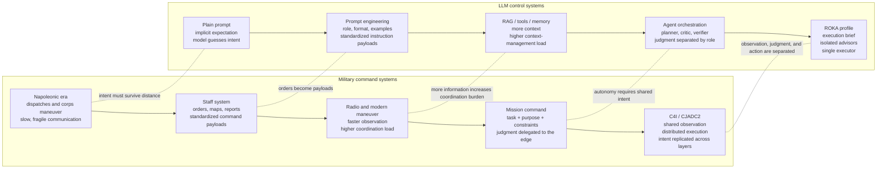
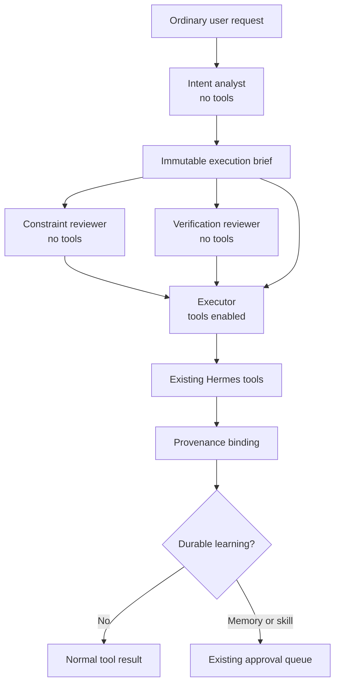

# ROKA-Agent

English | [한국어](README.ko.md) | [Español](README.es.md) |
[中文](README.zh-CN.md) | [اردو](README.ur-pk.md)

ROKA-Agent is an intent-preserving control profile for
[Hermes Agent](https://github.com/NousResearch/hermes-agent).

> Centralize observation, keep judgment at the edge, and replicate intent on
> both sides.

The user writes an ordinary request. ROKA compiles it into one execution brief,
runs three tool-free advisors in isolated contexts, and gives the same brief and
advice to one tool-enabled executor. Built-in memory and skill-tool changes are
treated as reviewable proposals instead of silent self-modification.

ROKA does not replace Hermes sessions, tools, model routing, memory, skills, or
approval storage. Its first engineering rule is **do not rebuild the wheel**:
extend existing Hermes functions at the smallest useful control points.

## Why Intent Matters

Many failures in AI use do not begin as model failures. They begin as intent
transfer failures.

A user often has a strong expectation but an underspecified request. The model
then produces an answer from the visible prompt, while the user evaluates it
against an invisible standard. Even a capable model can feel wrong when the
system never made the user's task, purpose, constraints, assumptions, and review
criteria explicit.

This is not unique to AI. Human organizations face the same problem. HR,
management theory, and military command doctrine all study the same loop:
define intent, transmit it, let another actor judge under incomplete context,
evaluate the result, and feed the correction back into the next order.

ROKA treats this as the central control problem for LLM agents. Technical
friction will keep shrinking as models, tools, and infrastructure improve. The
harder bottleneck is the human one: defining intent, communicating it, and
checking whether another actor understood it. ROKA tries to move that bottleneck
out of individual leadership instinct and into the default shape of the
execution system.

## Conceptual Origin

ROKA started from a structural analogy between two fields that look unrelated at
first glance: military command systems and prompt systems.

Napoleonic-era command already had the core problem: a commander could observe,
decide, and dispatch orders, but the unit receiving those orders had to act
later, elsewhere, under changed conditions. Modern command systems evolved from
simple orders toward richer command payloads: staff reports, maps, radio
coordination, mission command, C4I, and eventually joint data-centric concepts
such as CJADC2.

Prompt engineering has been moving through a parallel line. It began with plain
prompts, then structured prompts, role instructions, examples, tool policies,
memory, retrieval, and multi-agent orchestration. A plain prompt is like a short
order with too much left implicit. A pile of context is like a headquarters feed
with no mission command. A fully autonomous agent without shared intent becomes
locally clever and globally fragile.



The design question behind ROKA was therefore:

> What would an LLM control loop look like if we treated every user request as
> an intent package instead of a raw prompt?

ROKA's answer is the runtime pattern used in this fork:

- Compile the user's ordinary request into one immutable execution brief.
- Put constraint and verification judgment in separate tool-free advisor
  contexts.
- Give action to one tool-enabled executor.
- Preserve the same task, purpose, constraints, assumptions, deviation rule,
  autonomy policy, and review policy through every execution iteration.
- Treat missing, empty, or failed advisors as visible degraded state instead of
  pretending the full staff process happened.

This is also why ROKA avoids military vocabulary in the runtime interface. The
military analogy explains the origin of the idea; the implementation remains a
Hermes control profile built from existing Hermes concepts: MoA presets,
reference models, tools, memory, skills, approval gates, and provider routing.

## Context Is Not Always Alignment

More context is usually helpful, but context is not the same as intent.

Human organizations often develop local customs that once solved a coordination
problem but later become harmful habits. An AI agent can drift in the same way:
memory, retrieval, prior chat history, or tool traces may add context that is
true but no longer aligned with the current user's purpose.

ROKA therefore does not treat context accumulation as the final answer. Context
must be filtered through the current execution brief. The brief says what the
system is trying to do now, why it matters, what boundaries must hold, and what
evidence is required before the executor can claim completion.

## Release Status

**v0.1.0 released.** The runtime control path is implemented
and covered by focused and upstream regression tests. A live four-provider run
still requires the operator to configure Codex and OpenRouter credentials; the
release does not bundle or silently substitute credentials.

Implemented:

- Automatic execution-brief compilation from normal user messages.
- CLI and Gateway `/moa` turns enter the same virtual MoA control facade; the
  older context-only MoA path refuses ROKA-labelled payloads.
- Three isolated advisor roles and one tool-enabled executor.
- A stable brief for the entire user turn, including later tool iterations.
- Per-role logical session IDs and provider/model provenance.
- Actual fallback-route labels, accounting, and executor provenance.
- Independent constraint and verification reviews on each execution iteration.
- Loud degraded-mode reporting when an advisor is unavailable.
- A single acting executor; new `delegate_task` subagent spawns are blocked.
- ROKA-scoped approval gates for memory and skill writes.
- Fail-closed pending-write persistence and validated pending IDs.
- Evidence-gated background learning where `Nothing to save.` is normal.
- Direct, isolated background review without recursively launching another MoA.
- Fail-closed protection against an outer model fallback replacing the ROKA
  facade mid-turn; provider-level fallback inside each role remains observable.

ROKA is not a security sandbox, a bit-for-bit deterministic runtime, or a claim
that an LLM can perfectly infer intent. The [Control Boundary](#control-boundary)
section states exactly what the code enforces.

## Runtime Flow



The intent analyst runs first because the other roles must receive the exact
same brief. The constraint and verification reviewers then run independently in
parallel. Only the executor receives tool definitions.

| Role | Default route | Responsibility |
| --- | --- | --- |
| `intent_analyst` | `openai-codex:gpt-5.5` | Convert the request into task, purpose, constraints, assumptions, and review rules. |
| `constraint_reviewer` | `openrouter:deepseek/deepseek-v4-pro` | Find scope expansion, unsafe assumptions, conflicting constraints, and missing authority. |
| `verification_reviewer` | `openrouter:google/gemini-3-pro-preview` | Demand observable evidence, tests, and repeatability before completion claims. |
| `executor` | `openrouter:anthropic/claude-opus-4.8` | Act on the brief and reviewer findings using Hermes tools. |

These are defaults, not hard dependencies. Change models or providers in the
`roka` MoA preset while preserving the three unique `advisor_role` values.
If Hermes serves an advisor or executor through a configured fallback route,
ROKA records the actual provider/model separately instead of presenting the
configured route as the model that answered.

## Quick Start

Clone and install the fork:

```bash
git clone https://github.com/EESIZ/ROKA-Agent.git
cd ROKA-Agent
python -m pip install -e .
hermes setup
```

On native Windows, the existing Hermes PowerShell installer can provision the
same cloned fork. Run this from the `ROKA-Agent` checkout so the installer uses
that repository's `origin` instead of creating a separate upstream checkout:

```powershell
Set-ExecutionPolicy -Scope Process Bypass
.\scripts\install.ps1 -InstallDir (Get-Location).Path
```

The default profile uses Codex authentication for the intent analyst and an
OpenRouter API key for the other three models. Configure both through the normal
Hermes setup flow.

Start an interactive ROKA session:

```bash
hermes chat --provider moa --model roka
```

Then type normal requests. No hand-written JSON or special command packet is
required.

Inside a regular Hermes session, run one ROKA-controlled turn with:

```text
/moa <your ordinary request>
```

ROKA is the default one-shot MoA preset in this fork. Generic Hermes MoA presets
remain available and do not gain ROKA behavior unless they declare
`control_mode: roka` and the three required advisor roles.

## Execution Brief

One brief is compiled for each real user turn:

```json
{
  "brief_id": "brief_...",
  "task": "what must be done",
  "purpose": "why the result matters",
  "constraints": ["boundaries that must not be crossed"],
  "assumptions": ["premises currently treated as true"],
  "deviation_rule": "when and how the executor may depart",
  "autonomy_policy": "what may proceed without another question",
  "review_policy": "what evidence is required before completion"
}
```

If the intent model fails or returns malformed output, ROKA creates a
conservative fallback brief from the clean user request captured before
memory, retrieval, or plugin context is injected. It does not silently drop
the control layer. The same `brief_id` survives every tool iteration and an
in-turn transcript-compression session rotation, then changes on the next user
message. When later iterations display the original intent analysis again,
its label includes `[cached]`; only the two reviewers and executor are called
again.

Each model call receives a separate message list and logical
`agent_session_id`. Many provider APIs are stateless, so "session" here means an
isolated conversation history and audit identity, not a promise that the remote
provider stores server-side state.

## Learning Control

When ROKA is active, Hermes' built-in `memory` and `skill_manage` mutation paths
are routed through the existing approval gate even if the global compatibility
default is off.

- Memory writes may be approved inline when an interactive approval channel is
  present; otherwise they are staged.
- Skill writes are always staged because their behavioral impact and diff size
  are larger.
- Pending records include `brief_id`, parent and agent session IDs, role,
  provider, model, task/tool call IDs, and risk class.
- A pending record is reported as staged only after an atomic disk write
  succeeds.
- A staged result explicitly reports `saved: false` and
  `requires_approval: true`; background review notifications include its
  pending ID.
- Background review must identify durable evidence. It is no longer instructed
  to manufacture a skill update after most sessions.

Review proposals with the existing commands:

```text
/memory pending
/memory approve <id>
/memory reject <id>
/skills pending
/skills diff <id>
/skills approve <id>
/skills reject <id>
```

## Control Boundary

The runtime enforces:

- Exactly three enabled, uniquely named advisor roles in a saved ROKA preset.
- CLI and Gateway one-shot commands route through `provider=moa`; the legacy
  context-synthesis entry point rejects ROKA mode instead of simulating it.
- Intent compilation before reviewer fan-out.
- Tool-free advisor calls and a single tool-enabled executor.
- Removal of new subagent-spawn capability from the ROKA executor tool schema,
  with an execution-middleware block as defense in depth.
- Separate advisor message histories and logical session identities.
- One frozen `ExecutionBrief` object per user turn.
- The same brief in reviewer prompts and executor context, with its stable ID
  in tool provenance and background-learning metadata.
- Approval routing for ROKA memory and skill writes.
- Visible failure/degraded labels instead of claiming every role ran.
- Actual provider/model capture when Hermes uses an auxiliary fallback route.
- Refusal of the outer Hermes fallback that would replace the control facade
  with one direct model after an executor-route failure.

The runtime cannot enforce:

- Perfect semantic recovery of an underspecified or contradictory request.
- Identical natural-language output across stochastic model calls.
- Availability, behavior, or retention policy of third-party model providers.
- Truth of a reviewer opinion without external evidence.
- Semantic obedience by the executor to every brief or reviewer instruction;
  topology, context propagation, tool access, and approval routing are the
  mechanically enforced parts.
- Generic terminal/file writes, external memory-provider retention, or a
  third-party plugin that bypasses Hermes' memory and skill APIs.

For those reasons, verification reviewers guide the executor, while actual tool
results and tests remain the evidence of completion.

The approval boundary covers the built-in `memory` and `skill_manage` APIs. The
background reviewer is runtime-whitelisted to those APIs only. The foreground
executor still has ordinary Hermes tools, including powerful terminal and file
operations, so ROKA is not a filesystem sandbox. Its prompt explicitly forbids
using those tools to bypass approval, but hostile or out-of-process code must be
controlled by operating-system isolation and plugin review.

## Configuration

The shipped `roka` preset lives in
[`hermes_cli/config_defaults.py`](hermes_cli/config_defaults.py). Override it in
the normal Hermes `config.yaml`:

```yaml
moa:
  default_preset: roka
  presets:
    roka:
      control_mode: roka
      fanout: per_iteration
      reference_models:
        - provider: openai-codex
          model: gpt-5.5
          advisor_role: intent_analyst
        - provider: openrouter
          model: deepseek/deepseek-v4-pro
          advisor_role: constraint_reviewer
        - provider: openrouter
          model: google/gemini-3-pro-preview
          advisor_role: verification_reviewer
      aggregator:
        provider: openrouter
        model: anthropic/claude-opus-4.8
```

Validation rejects missing, duplicate, disabled, or unknown ROKA advisor roles
at the configuration write boundary. A hand-edited invalid file runs visibly in
degraded mode rather than silently relabeling models.

## Development

Install development dependencies in a local virtual environment, then use the
repository's canonical per-file test runner:

```bash
python -m venv .venv
python -m pip install -e ".[dev]"
scripts/run_tests.sh tests/agent/test_roka_control.py \
  tests/agent/test_roka_moa_control.py \
  tests/agent/test_roka_tool_binding.py \
  tests/agent/test_roka_background_review.py \
  tests/tools/test_write_approval.py
```

Do not invoke pytest directly. See
[`mydocs/working/roka-v0.1-final.md`](mydocs/working/roka-v0.1-final.md) for the
release evidence and [`docs/roka-function-impact-map.md`](docs/roka-function-impact-map.md)
for the Hermes function map.

## Design Rules

1. Reuse Hermes before adding a subsystem.
2. Preserve the user's purpose and constraints across every judgment point.
3. Keep model histories isolated; merge findings, not mutable transcripts.
4. Treat durable learning as a proposal backed by evidence.
5. Prefer observable test results over agent self-evaluation.
6. Keep generic Hermes behavior compatible outside ROKA mode.

## License

Source code remains under the upstream-compatible [MIT License](LICENSE).

ROKA-specific methodology prose, diagrams, and project language are licensed
separately under
[CC BY-NC-SA 4.0](ROKA-CONTENT-LICENSE.md). This content license does not apply
to source code or inherited Hermes material, and copyright does not grant
exclusive ownership of abstract ideas, systems, or methods.

ROKA-Agent is a fork of Hermes Agent. Upstream attribution and documentation:

- [NousResearch/hermes-agent](https://github.com/NousResearch/hermes-agent)
- [Hermes Agent documentation](https://hermes-agent.nousresearch.com/docs/)
