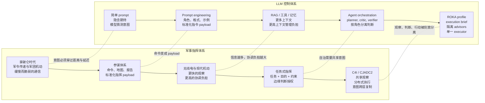

> 本文件顶部包含 ROKA 起源说明。后面的 Hermes Agent 继承翻译可能不描述当前
> ROKA control profile。完整项目文档请参见 [README.md](README.md)。

## ROKA 起源说明

ROKA 的出发点是一个简单观察：许多 AI 使用失败并不是从模型能力失败开始，
而是从意图传递失败开始。用户往往有很强的期待，但没有把期待完整地定义进
指令。模型根据可见 prompt 作答，而用户却用不可见的标准评价结果。

这不是 AI 独有的问题。人类组织也长期面对同一问题。HR、组织管理、领导力
研究和军事指挥理论都在处理同一个循环：定义意图，传递意图，让另一个行动
者在不完整上下文中判断，评估结果，并把修正反馈到下一次命令。

ROKA 来自两条平行演化线的类比：一条是从拿破仑时代到 C4I/CJADC2 的军事
指挥体系，另一条是从简单 prompt 到 agent orchestration 的 LLM 控制体系。



更多上下文并不总是等于更好的对齐。组织中有些惯例原本用于解决协调问题，
后来却可能变成坏习惯。AI agent 也会发生类似漂移：记忆、RAG、历史对话、
工具轨迹可能都是真的，却不再符合当前用户的目的。

因此 ROKA 不把堆叠上下文当作最终答案。所有上下文都必须通过当前 execution
brief 解释：现在要做什么，为什么重要，哪些边界不能越过，以及需要什么证据
才能宣称完成。

# Hermes Agent ☤

<p align="center">
  <a href="https://hermes-agent.nousresearch.com/docs/"></a>
  <a href="https://discord.gg/NousResearch"></a>
  <a href="https://github.com/NousResearch/hermes-agent/blob/main/LICENSE"></a>
  <a href="https://nousresearch.com"></a>
  <a href="README.md"></a>
  <a href="README.ur-pk.md"></a>
</p>

**由 [Nous Research](https://nousresearch.com) 构建的自进化 AI 代理。** 它是唯一内置学习闭环的智能代理——从经验中创建技能，在使用中改进技能，主动持久化知识，搜索过往对话，并在跨会话中逐步构建对你的深度理解。可以在 $5 的 VPS 上运行，也可以在 GPU 集群上运行，或者使用几乎零成本的 Serverless 基础设施。它不绑定你的笔记本——你可以在 Telegram 上与它对话，而它在云端 VM 上工作。

支持任意模型——[Nous Portal](https://portal.nousresearch.com)、[OpenRouter](https://openrouter.ai)（200+ 模型）、[NVIDIA NIM](https://build.nvidia.com)（Nemotron）、[小米 MiMo](https://platform.xiaomimimo.com)、[z.ai/GLM](https://z.ai)、[Kimi/Moonshot](https://platform.moonshot.ai)、[MiniMax](https://www.minimax.io)、[Hugging Face](https://huggingface.co)、OpenAI，或自定义端点。使用 `hermes model` 即可切换——无需改代码，无锁定。

<table>
<tr><td><b>真正的终端界面</b></td><td>完整的 TUI，支持多行编辑、斜杠命令自动补全、对话历史、中断重定向和流式工具输出。</td></tr>
<tr><td><b>随你所在</b></td><td>Telegram、Discord、Slack、WhatsApp、Signal 和 CLI——全部从单个网关进程运行。语音备忘录转写、跨平台对话连续性。</td></tr>
<tr><td><b>闭环学习</b></td><td>代理管理记忆并定期自我提醒。复杂任务后自动创建技能。技能在使用中自我改进。FTS5 会话搜索配合 LLM 摘要实现跨会话回溯。<a href="https://github.com/plastic-labs/honcho">Honcho</a> 辩证式用户建模。兼容 <a href="https://agentskills.io">agentskills.io</a> 开放标准。</td></tr>
<tr><td><b>定时自动化</b></td><td>内置 cron 调度器，支持向任何平台投递。日报、夜间备份、周审计——全部用自然语言描述，无人值守运行。</td></tr>
<tr><td><b>委派与并行</b></td><td>生成隔离子代理处理并行工作流。编写 Python 脚本通过 RPC 调用工具，将多步管道压缩为零上下文开销的轮次。</td></tr>
<tr><td><b>随处运行</b></td><td>六种终端后端——本地、Docker、SSH、Daytona、Singularity 和 Modal。Daytona 和 Modal 提供 Serverless 持久化——代理环境空闲时休眠、按需唤醒，空闲期间几乎零成本。$5 VPS 或 GPU 集群都能跑。</td></tr>
<tr><td><b>研究就绪</b></td><td>批量轨迹生成、轨迹压缩——用于训练下一代工具调用模型。</td></tr>
</table>

---

## 快速安装

```bash
curl -fsSL https://hermes-agent.nousresearch.com/install.sh | bash
```

支持 Linux、macOS、WSL2 和 Android (Termux)。安装程序会自动处理平台特定的配置。

> **Android / Termux：** 已测试的手动安装路径请参考 [Termux 指南](https://hermes-agent.nousresearch.com/docs/getting-started/termux)。在 Termux 上，Hermes 会安装精选的 `.[termux]` 扩展，因为完整的 `.[all]` 扩展会拉取 Android 不兼容的语音依赖。
>
> **Windows：** 在 PowerShell 中运行：
> ```powershell
> iex (irm https://hermes-agent.nousresearch.com/install.ps1)
> ```
> 安装完成后，可能需要重启终端，然后运行 `hermes` 开始对话。

安装后：

```bash
source ~/.bashrc    # 重新加载 shell（或: source ~/.zshrc）
hermes              # 开始对话！
```

---

## 快速入门

```bash
hermes              # 交互式 CLI — 开始对话
hermes model        # 选择 LLM 提供商和模型
hermes tools        # 配置启用的工具
hermes config set   # 设置单个配置项
hermes gateway      # 启动消息网关（Telegram、Discord 等）
hermes setup        # 运行完整设置向导（一次性配置所有内容）
hermes claw migrate # 从 OpenClaw 迁移（如果来自 OpenClaw）
hermes update       # 更新到最新版本
hermes doctor       # 诊断问题
```

📖 **[完整文档 →](https://hermes-agent.nousresearch.com/docs/)**

---

## 省去到处收集 API Key — Nous Portal

Hermes 始终允许你使用任意服务商，这点不会改变。但如果你不想为模型、网页搜索、图像生成、TTS、云浏览器分别去申请五个不同的 API Key，**[Nous Portal](https://portal.nousresearch.com)** 用一个订阅就能覆盖全部：

- **300+ 模型** — 用 `/model <name>` 随时切换
- **Tool Gateway** — 网页搜索（Firecrawl）、图像生成（FAL）、文本转语音（OpenAI）、云浏览器（Browser Use），全部通过订阅托管。无需额外注册任何账户。

全新安装时一条命令即可：

```bash
hermes setup --portal
```

它会通过 OAuth 登录、把 Nous 设为推理服务商，并启用 Tool Gateway。随时用 `hermes portal info` 查看路由状态。完整说明见 [Tool Gateway 文档](https://hermes-agent.nousresearch.com/docs/user-guide/features/tool-gateway)。

你随时可以按工具单独切回自己的 API Key — Gateway 是按工具粒度生效的，不是一刀切。

---

## CLI 与消息平台 快速对照

Hermes 有两种入口：用 `hermes` 启动终端 UI，或运行网关从 Telegram、Discord、Slack、WhatsApp、Signal 或 Email 与之对话。进入对话后，许多斜杠命令在两种界面中通用。

| 操作 | CLI | 消息平台 |
|------|-----|----------|
| 开始对话 | `hermes` | 运行 `hermes gateway setup` + `hermes gateway start`，然后给机器人发消息 |
| 开始新对话 | `/new` 或 `/reset` | `/new` 或 `/reset` |
| 更换模型 | `/model [provider:model]` | `/model [provider:model]` |
| 设置人格 | `/personality [name]` | `/personality [name]` |
| 重试或撤销上一轮 | `/retry`、`/undo` | `/retry`、`/undo` |
| 压缩上下文 / 查看用量 | `/compress`、`/usage`、`/insights [--days N]` | `/compress`、`/usage`、`/insights [days]` |
| 浏览技能 | `/skills` 或 `/<skill-name>` | `/skills` 或 `/<skill-name>` |
| 中断当前工作 | `Ctrl+C` 或发送新消息 | `/stop` 或发送新消息 |
| 平台特定状态 | `/platforms` | `/status`、`/sethome` |

完整命令列表请参阅 [CLI 指南](https://hermes-agent.nousresearch.com/docs/user-guide/cli) 和 [消息网关指南](https://hermes-agent.nousresearch.com/docs/user-guide/messaging)。

---

## 文档

所有文档位于 **[hermes-agent.nousresearch.com/docs](https://hermes-agent.nousresearch.com/docs/)**：

| 章节 | 内容 |
|------|------|
| [快速开始](https://hermes-agent.nousresearch.com/docs/getting-started/quickstart) | 安装 → 设置 → 2 分钟内开始首次对话 |
| [CLI 使用](https://hermes-agent.nousresearch.com/docs/user-guide/cli) | 命令、快捷键、人格、会话 |
| [配置](https://hermes-agent.nousresearch.com/docs/user-guide/configuration) | 配置文件、提供商、模型、所有选项 |
| [消息网关](https://hermes-agent.nousresearch.com/docs/user-guide/messaging) | Telegram、Discord、Slack、WhatsApp、Signal、Home Assistant |
| [安全](https://hermes-agent.nousresearch.com/docs/user-guide/security) | 命令审批、DM 配对、容器隔离 |
| [工具与工具集](https://hermes-agent.nousresearch.com/docs/user-guide/features/tools) | 40+ 工具、工具集系统、终端后端 |
| [技能系统](https://hermes-agent.nousresearch.com/docs/user-guide/features/skills) | 过程记忆、技能中心、创建技能 |
| [记忆](https://hermes-agent.nousresearch.com/docs/user-guide/features/memory) | 持久记忆、用户画像、最佳实践 |
| [MCP 集成](https://hermes-agent.nousresearch.com/docs/user-guide/features/mcp) | 连接任意 MCP 服务器扩展能力 |
| [定时调度](https://hermes-agent.nousresearch.com/docs/user-guide/features/cron) | 定时任务与平台投递 |
| [上下文文件](https://hermes-agent.nousresearch.com/docs/user-guide/features/context-files) | 影响每次对话的项目上下文 |
| [架构](https://hermes-agent.nousresearch.com/docs/developer-guide/architecture) | 项目结构、代理循环、关键类 |
| [贡献](https://hermes-agent.nousresearch.com/docs/developer-guide/contributing) | 开发设置、PR 流程、代码风格 |
| [CLI 参考](https://hermes-agent.nousresearch.com/docs/reference/cli-commands) | 所有命令和标志 |
| [环境变量](https://hermes-agent.nousresearch.com/docs/reference/environment-variables) | 完整环境变量参考 |

---

## 从 OpenClaw 迁移

如果你来自 OpenClaw，Hermes 可以自动导入你的设置、记忆、技能和 API 密钥。

**首次安装时：** 安装向导（`hermes setup`）会自动检测 `~/.openclaw` 并在配置开始前提供迁移选项。

**安装后任意时间：**

```bash
hermes claw migrate              # 交互式迁移（完整预设）
hermes claw migrate --dry-run    # 预览将要迁移的内容
hermes claw migrate --preset user-data   # 仅迁移用户数据，不含密钥
hermes claw migrate --overwrite  # 覆盖已有冲突
```

导入内容：
- **SOUL.md** — 人格文件
- **记忆** — MEMORY.md 和 USER.md 条目
- **技能** — 用户创建的技能 → `~/.hermes/skills/openclaw-imports/`
- **命令白名单** — 审批模式
- **消息设置** — 平台配置、允许用户、工作目录
- **API 密钥** — 白名单中的密钥（Telegram、OpenRouter、OpenAI、Anthropic、ElevenLabs）
- **TTS 资产** — 工作区音频文件
- **工作区指令** — AGENTS.md（使用 `--workspace-target`）

使用 `hermes claw migrate --help` 查看所有选项，或使用 `openclaw-migration` 技能进行交互式代理引导迁移（含干运行预览）。

---

## 贡献

欢迎贡献！请参阅 [贡献指南](https://hermes-agent.nousresearch.com/docs/developer-guide/contributing) 了解开发设置、代码风格和 PR 流程。

贡献者快速开始——使用标准安装器，然后在它创建的完整 git checkout 中开发：
`$HERMES_HOME/hermes-agent`（通常是 `~/.hermes/hermes-agent`）。这会匹配
`hermes update`、托管 venv、lazy dependencies、gateway 和 docs tooling 使用的布局。

```bash
curl -fsSL https://hermes-agent.nousresearch.com/install.sh | bash
cd "${HERMES_HOME:-$HOME/.hermes}/hermes-agent"
uv pip install -e ".[all,dev]"
scripts/run_tests.sh
```

手动克隆备用路径（用于一次性 clone / CI，或你明确不想使用 managed install layout 时）：

```bash
curl -LsSf https://astral.sh/uv/install.sh | sh
uv venv venv --python 3.11
source venv/bin/activate
uv pip install -e ".[all,dev]"
python -m pytest tests/ -q
```

---

## 社区

- 💬 [Discord](https://discord.gg/NousResearch)
- 📚 [技能中心](https://agentskills.io)
- 🐛 [问题反馈](https://github.com/NousResearch/hermes-agent/issues)
- 💡 [讨论区](https://github.com/NousResearch/hermes-agent/discussions)
- 🔌 [HermesClaw](https://github.com/AaronWong1999/hermesclaw) — 社区微信桥接：在同一微信账号上运行 Hermes Agent 和 OpenClaw。

---

## 许可证

MIT — 详见 [LICENSE](LICENSE)。

由 [Nous Research](https://nousresearch.com) 构建。
