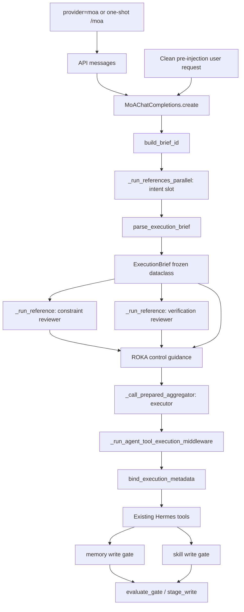

# ROKA Function Impact Map

This document records the implemented ROKA v0.1 call graph. It is the review
map for changes that affect intent compilation, model isolation, tool
provenance, or durable learning.

## Runtime Graph

## Function-Level Changes

| Surface | Function or object | Implemented adjustment | Direct impact |
| --- | --- | --- | --- |
| Defaults | `hermes_cli.config_defaults.DEFAULT_CONFIG["moa"]` | Adds the `roka` preset and makes it the fork's one-shot MoA default. | Fresh and merged configs expose four default model routes. Plain non-MoA sessions are unchanged. |
| One-shot entry | `cli.HermesCLI.handle_command(...)`, `gateway.run.GatewayRunner._handle_message(...)` | Temporarily selects the virtual `provider=moa` ROKA preset, including when no user MoA block loaded. | CLI and messaging-platform `/moa` requests use the real control facade rather than the legacy context helper. |
| Legacy guard | `agent.conversation_loop.run_conversation(...)`, `reject_legacy_roka_execution(...)` | Rejects `control_mode: roka` on the old `moa_config` context-only contract. | A weaker three-reference synthesis cannot present itself as ROKA. Generic legacy MoA remains compatible. |
| Config parsing | `hermes_cli.moa_config._clean_slot(...)` | Preserves a known `advisor_role`. | Role identity survives config normalization. |
| Config validation | `_slot_problem(...)`, `validate_moa_payload(...)` | Reject unknown modes/roles and require exactly three enabled unique roles. | Dashboard/CLI config writes cannot save a falsely complete ROKA preset. |
| Config reads | `_normalize_preset(...)` | Preserves `control_mode: roka`. | Runtime can distinguish ROKA from generic MoA. |
| CLI config | `hermes_cli.moa_cmd.cmd_moa(...)` | Treats ROKA references as three fixed role slots and validates before saving. | Interactive reconfiguration can change routes without losing role identity. |
| Web schema | `MoaModelSlot`, `MoaPresetPayload`, `MoaConfigPayload` | Round-trips `advisor_role` and `control_mode`. | Dashboard saves cannot strip the ROKA contract. |
| Web editor | `web/src/pages/ModelsPage.tsx` | Shows advisor roles and fixes the three-slot shape while allowing model replacement. | Users cannot accidentally disable/add/remove a required ROKA role in the UI. |
| Desktop editor | `apps/desktop/src/app/settings/model-settings.tsx` | Applies the same fixed-role controls and preserves role/mode types. | Electron users get the same ROKA configuration contract instead of a rejected autosave. |
| Brief model | `agent.roka_control.ExecutionBrief` | Frozen turn-scoped task, purpose, constraints, assumptions, deviation, autonomy, and review policy. | One semantic contract is reused throughout a user turn. |
| Brief identity | `build_brief_id(...)`, `resolve_prompt_cache_scope_safe(...)` | Uses the live turn ID plus the compression-lineage root session, with a deterministic message-prefix fallback for direct callers. | Tool iterations and in-turn transcript compression keep one ID; a new user turn gets a new ID. |
| Agent identity | `build_agent_session_id(...)` | Derives stable role/provider/model-specific logical IDs. | Four roles cannot share an audit identity. |
| Brief parsing | `parse_execution_brief(...)` | Requires the complete brief shape, clips fields, adds mandatory constraints, falls back conservatively, and re-renders accepted input canonically. | Empty/partial/failed intent output cannot masquerade as a successful compilation; extra raw intent prose does not become executor advice. |
| Advisor prompts | `advisor_system_prompt(...)` | Adds role, logical session, and brief ID to every advisor; reviewers also receive the exact compiled brief. | Intent runs first; both reviewers receive the same immutable brief. |
| MoA call order | `MoAChatCompletions.prepare(...)`, `create(...)` | Runs intent once per user turn, then two reviewers per configured cadence, then the aggregator. The agent loop separately passes the clean pre-injection request for conservative fallback compilation. | First iteration is four model calls; later `per_iteration` loops are two reviewer calls plus executor, and failed intent compilation cannot turn injected retrieval text into the user's task. |
| MoA reference call | `_run_reference(...)`, `_run_references_parallel(...)` | Uses role-specific prompts and deep-copied per-call message objects. | Provider adapters cannot mutate another role's logical context; mixed routes still use Hermes routing. |
| Route accounting | `_resolved_route(...)`, `call_llm(..., route_info=...)` | Compares the configured slot with the provider/model that actually served the call. | Advisor labels/cost and executor provenance do not falsely attribute fallback output to the configured model. |
| Direct-worker fallback | `agent.chat_completion_helpers.try_activate_fallback(...)`, `update_execution_route_for_agent(...)` | Updates bound ROKA route provenance after a direct background-review worker changes provider/model. | A learning proposal cannot retain the pre-fallback model label after another model actually issued it. |
| Executor context | `MoAChatCompletions.create(...)` guidance assembly | Appends the canonical brief, executor session, failed-role state, and the two reviewer findings at the prompt tail. | Prompt-cache prefix stays stable while raw intent-model prose cannot rewrite the compiled brief. |
| Accounting | `_accounting_without_usage(...)` | Reuses intent evidence without charging its tokens on later tool iterations and labels it `[cached]`. | Session cost includes the real intent call once, and observability does not imply a second call. |
| Agent state | `apply_execution_brief_to_agent(...)` | Attaches brief/session/role/model provenance to the existing `AIAgent`. | Tool middleware and background review can read one identity source. |
| Mode exit | `clear_execution_brief_from_agent(...)`, `agent.agent_runtime_helpers.switch_model(...)` | Clears ROKA state after a successful switch away from provider `moa`. | A prior brief cannot govern a later plain-model session. |
| Outer fallback | `agent.chat_completion_helpers.try_activate_fallback(...)` | Refuses an agent-level fallback while the acting route is the ROKA MoA facade. | An executor failure cannot silently turn later iterations into one direct model with no reviewers. Role-level `call_llm` fallback remains available and attributable. |
| Tool boundary | `agent.tool_executor._run_agent_tool_execution_middleware(...)` | Binds execution metadata around the actual dispatch callback and blocks new ROKA `delegate_task` spawns. | Sequential and concurrent tools receive the same context; no unbriefed child executor can bypass the four-role v0.1 topology. |
| Executor tools | `_call_prepared_aggregator(...)` | Removes `delegate_task` from the ROKA executor schema. | The acting model is not invited to create a child that lacks brief/approval inheritance. |
| Approval policy | `tools.write_approval.evaluate_gate(...)` | Treats bound ROKA context as approval enabled for memory and skills. | Global Hermes compatibility defaults can remain off outside ROKA mode. |
| Pending persistence | `stage_write(...)` | Treats dispatch-bound provenance as authoritative over caller audit hints, adds risk/origin, writes atomically, and raises on failure. | A nested helper cannot relabel the active brief/role/route, and a tool cannot report a nonexistent pending record as staged. |
| Pending lookup | `_pending_path(...)`, `get_pending(...)`, `discard_pending(...)` | Uses full UUID entropy and accepts only bounded hexadecimal record IDs. | Collision risk is not artificially reduced to 32 bits, and path traversal is rejected. |
| Memory | `tools.memory_tool._apply_write_gate(...)`, `_apply_batch_write_gate(...)` | Reuses the gate and converts gate-load or persistence failure into a failed ROKA tool result. | No ROKA memory mutation occurs when approval cannot be enforced. |
| Skills | `_skill_execution_metadata(...)`, `_apply_skill_write_gate(...)` | Carries current brief metadata into existing skill proposals and fails visibly when approval cannot be enforced. | No new mutation path or tool schema is introduced. |
| Learning prompt | `_MEMORY_REVIEW_PROMPT`, `_SKILL_REVIEW_PROMPT`, `_COMBINED_REVIEW_PROMPT` | Requires durable evidence and makes no-op review normal. | Removes the upstream pressure to manufacture a skill update. |
| Review snapshot | `spawn_background_review_thread(...)` | Captures brief, parent session, and executor route before launching the thread. | A delayed review cannot inherit the next foreground turn's brief. |
| Review routing | `_resolve_review_runtime(...)` | Routes a ROKA review directly to the real executor model, overriding any pre-existing auxiliary review route. | Background review cannot recursively launch another MoA through `auxiliary.background_review`. |
| Review agent | `_run_review_in_thread(...)` | Applies the captured brief and a unique `background_reviewer` logical ID. | Existing DB/external-memory isolation remains intact and learning is attributable. |
| Review notification | `summarize_background_review_actions(...)` | Recognizes staged proposals and reports their pending IDs. | A successful background staging action is not silently hidden as “nothing changed.” |
| Memory mirror | `build_memory_write_metadata(...)` | Merges common ROKA provenance and defaults ROKA learning to approval-required risk. | External memory notifications use the same identity as built-in pending records. |

## Compatibility Boundaries

The implementation deliberately does not change:

- global model tool schemas (ROKA filters delegation request-locally);
- the generic MoA preset contract;
- memory or skill replay payloads;
- session database schema;
- external memory prefetch/sync behavior;
- Hermes guardrails, plugin hooks, or relay dispatch;
- upstream website assets and package/import names.

The only new core module is `agent/roka_control.py`; orchestration, routing,
parallelism, tools, and pending storage remain Hermes-owned.

## Failure Behavior

| Failure | Runtime result |
| --- | --- |
| Intent advisor unavailable or malformed | Conservative fallback brief; failed role is visible. |
| One reviewer unavailable | Executor receives the surviving review plus a loud failed-role label. |
| Duplicate or invalid hand-edited role | Invalid slot is not called and is emitted as failed degraded state. |
| Unknown hand-edited `control_mode` | The turn fails before any model call instead of silently becoming generic MoA. |
| Advisor or executor provider-level fallback | Configured and actual routes are both retained; accounting/provenance use the actual route. |
| Direct background-review fallback | The review keeps ROKA approval context and updates provenance to the actual provider/model. |
| All advisors unavailable | Executor receives the fallback brief and explicit degraded state. |
| ROKA preset is disabled but explicitly selected | The turn fails before any model call; the executor cannot run alone under a ROKA preset name. |
| Executor unavailable after its provider-level fallback chain | The turn fails; the outer fallback is refused because replacing `provider=moa` would bypass the control facade. |
| ROKA sent through legacy `moa_config` | The turn fails before execution and directs the caller to the virtual MoA provider path. |
| Executor requests new delegation | Tool is absent from the schema; a forged spawn call is blocked by middleware. |
| Pending record cannot be written | Memory/skill tool returns failure; no durable write occurs. |
| Approval module unavailable during a ROKA write | Memory/skill tool fails closed; generic Hermes retains its compatibility behavior. |
| Invalid pending ID | Lookup returns no record and discard returns false. |
| Switch away from ROKA | Brief and logical role state are cleared. |

## Required Regression Areas

Changes to any function above must run the canonical test runner over:

- `tests/agent/test_roka_*.py`
- `tests/agent/test_moa_*.py`
- `tests/run_agent/test_moa_*.py`
- `tests/agent/test_background_review*.py`
- `tests/run_agent/test_background_review*.py`
- `tests/tools/test_write_approval.py`
- `tests/hermes_cli/test_moa_config.py`
- `tests/cli/test_moa_command.py`
- `tests/e2e/test_platform_commands.py`

See `mydocs/working/roka-v0.1-final.md` for the release run.
