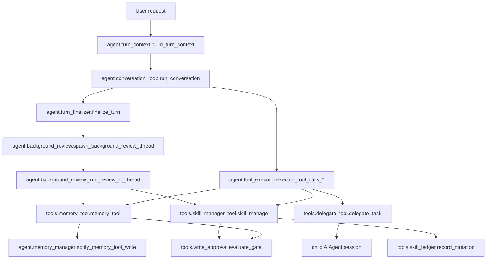

# ROKA Function Impact Map

This map identifies the Hermes functions ROKA is likely to touch before any
runtime implementation begins. Scope is intentionally limited to the
Execution Brief, session separation, background review, memory, skill, and
delegation surfaces.

## Scope Rule

ROKA must not improve Hermes by broad rewrite.

Before changing code, each proposed change must name:

- the original Hermes function,
- the smallest ROKA adjustment,
- direct callers or downstream effects,
- whether prompt cache, session persistence, tool schemas, or approval behavior
  are affected.

## High-Level Flow

## Function Map

| Area | Hermes function | Current role | ROKA adjustment | Impact |
| --- | --- | --- | --- | --- |
| Turn setup | `agent.turn_context.build_turn_context(...)` | Builds per-turn prompt/context, loads memory, handles preflight setup. | Add or pass an immutable execution-brief block as turn-scoped context. | Prompt content, memory recall, compaction behavior. Must preserve prompt-cache assumptions. |
| Turn setup | `agent.turn_context.consume_gateway_turn_context_notes(...)` | Pulls gateway-provided per-turn context notes. | Possible insertion point for gateway-origin execution brief notes. | Gateway sessions only; avoid changing cached system prompt. |
| Turn completion | `agent.turn_finalizer.finalize_turn(...)` | Finalizes response, syncs memory providers, decides whether background review should spawn. | Attach brief/session metadata to review spawn; classify review eligibility by brief policy. | Background review timing, memory sync, visible user response unaffected if done carefully. |
| Background review | `agent.background_review.load_background_review_settings()` | Reads `auxiliary.background_review` config and enabled state. | Add ROKA profile defaults or policy interpretation without changing global default unexpectedly. | Config behavior; low code risk if additive. |
| Background review | `agent.background_review._resolve_review_runtime(...)` | Selects model/provider for review fork. | Record `model_provider` and `model` into review metadata for reproducibility. | Review cost/routing; no behavior change required. |
| Background review | `agent.background_review._digest_history(...)` | Produces shorter replay for routed review models. | Ensure execution brief survives digest or is reattached explicitly. | Review quality when using a different model. |
| Background review | `agent.background_review._run_review_in_thread(...)` | Creates forked `AIAgent`, disables DB persistence, whitelists memory/skill tools. | Add `brief_id`, `agent_session_id`, `agent_role=background_reviewer`; enforce write metadata. | Session isolation, approval staging, prompt cache. High-value adjustment point. |
| Background review | `agent.background_review.spawn_background_review_thread(...)` | Chooses memory/skill/combined review prompt and starts review thread. | Replace aggressive skill-learning prompt with risk-classified learning prompt. | Skill creation frequency, reproducibility. No new subsystem needed. |
| Background review | `agent.background_review.build_memory_write_metadata(...)` | Builds provenance for external memory-provider mirrors. | Extend metadata with `brief_id`, `agent_session_id`, `agent_role`, `risk_class`, `evidence_refs`. | External memory mirrors and audit. Additive if keys are optional. |
| Background review | `agent.background_review.summarize_background_review_actions(...)` | Surfaces memory/skill actions after review. | Include staged/proposed learning status and risk class in summaries. | User visibility. Low runtime risk. |
| Approval | `tools.write_approval.write_approval_enabled(...)` | Reads `memory.write_approval` or `skills.write_approval`; default false. | ROKA profile should turn on at least `skills.write_approval`. | Policy/config. Avoid hard-forcing unless user chooses. |
| Approval | `tools.write_approval.evaluate_gate(...)` | Decides allow, stage, or block. | Prefer reuse; later add origin-sensitive policy only if boolean gate is insufficient. | Memory/skill persistence. Central gate, must test. |
| Approval | `tools.write_approval.stage_write(...)` | Writes pending records under `<HERMES_HOME>/pending/...`. | Add optional execution-brief/session metadata to pending records. | Pending UI/CLI compatibility. Should be additive. |
| Memory | `tools.memory_tool.memory_tool(...)` | Main memory tool entrypoint. | Avoid first-pass changes except ensuring metadata path remains available after staged writes. | User profile and memory persistence. |
| Memory | `tools.memory_tool._apply_write_gate(...)` | Gates single memory mutations. | Later candidate for origin/risk-specific staging. | Memory write behavior. Requires tests. |
| Memory | `tools.memory_tool._apply_batch_write_gate(...)` | Gates batch memory mutations. | Same as single gate; preserve atomic batch semantics. | Batch memory safety. |
| Memory | `tools.memory_tool.apply_memory_pending(...)` | Applies approved pending memory write. | Ensure pending metadata is audit-only and does not alter replay payload. | Approval replay. |
| External memory | `agent.memory_manager.prefetch_all(...)` | Retrieves external memory before model call. | Keep read-only; possibly pass `brief_id` only if provider can isolate by session. | Context recall. Risk if providers treat metadata as new namespace. |
| External memory | `agent.memory_manager.sync_all(...)` | Asynchronously syncs completed turns to providers. | Child/reviewer agents should either not sync or sync under isolated `agent_session_id`. | Reproducibility and cross-agent contamination. |
| External memory | `agent.memory_manager.notify_memory_tool_write(...)` | Mirrors committed built-in memory writes externally. | Use extended metadata from `build_memory_write_metadata(...)`. | External provider audit. |
| Skill write | `tools.skill_manager_tool.skill_manage(...)` | Main skill mutation entrypoint. | Reuse existing gate; add metadata to staged payloads if present. | Skill persistence, sync push, ledger. |
| Skill write | `tools.skill_manager_tool._apply_skill_write_gate(...)` | Stages skill writes when `skills.write_approval` is enabled. | Include execution-brief/session metadata in pending skill records. | Pending approval. High-value low-scope patch. |
| Skill guard | `tools.skill_manager_tool._background_review_write_guard(...)` | Blocks autonomous edits to protected/non-curator-managed skills. | Keep. ROKA should document this as inherited protection. | Prevents silent mutation of user-owned/protected skills. |
| Skill guard | `tools.skill_manager_tool._background_review_read_before_write_guard(...)` | Requires review fork to read target before writing. | Keep. Could add risk classification requirement later. | Prevents inferred patches. |
| Skill write | `tools.skill_manager_tool._create_skill(...)` | Creates new local skill. | Under ROKA, background-created skills should usually stage/propose. | New durable behavior. Requires approval policy. |
| Skill write | `tools.skill_manager_tool._patch_skill(...)` | Targeted patch to skill/support file. | Keep as preferred mutation once approved. | Future agent behavior changes. |
| Skill write | `tools.skill_manager_tool._edit_skill(...)` | Full rewrite of `SKILL.md`. | Treat as high-risk proposal unless foreground user-directed. | High blast radius. |
| Skill write | `tools.skill_manager_tool._write_file(...)` | Adds or overwrites skill support file. | Stage when background or reviewer-origin; auto-allow only low-risk evidence files if policy allows. | Skill library behavior and artifacts. |
| Skill audit | `tools.skill_ledger.record_mutation(...)` | Append-only audit after mutation. | Add brief/session metadata if function already accepts evidence or can carry extended evidence. | Audit only. Should not become a gate. |
| Delegation | `tools.delegate_tool.delegate_task(...)` | Spawns one or more isolated subagents. | Map Execution Brief into `goal`, `context`, `tasks[]`, and possibly hidden metadata. | Orchestration behavior and child sessions. |
| Delegation | `tools.delegate_tool._build_child_agent(...)` | Constructs child `AIAgent` with inherited runtime/toolsets. | Ensure each child has unique `agent_session_id` and shared `brief_id`. | Session isolation, provider/model selection. |
| Delegation | `tools.delegate_tool._run_single_child(...)` | Runs a child task and captures result. | Require structured output with findings/evidence/deviation report. | Parent aggregation quality. |
| Delegation | `tools.delegate_tool._finalize_child_results(...)` | Aggregates child results into parent result. | Merge summaries and evidence only; never merge mutable histories. | Parent context size and determinism. |
| Delegation | `tools.delegate_tool._validate_batch_tasks(...)` | Validates batch fan-out quality. | Add execution-brief completeness checks for batch reviewer roles. | Prevents malformed multi-agent orchestration. |
| Lifecycle | `agent.subagent_lifecycle.SubagentLaunchRequest` | Structured launch request with `goal`, `context`, `metadata`. | Preferred place to carry `brief_id`, `agent_role`, risk policy, and constraints without new core schema. | Additive. Metadata limit is 8192 bytes. |
| Lifecycle | `agent.subagent_lifecycle.SubagentLifecycleService.launch(...)` | Validates and launches subagent lifecycle records. | Ensure metadata validation permits ROKA keys and records session linkage. | Session tracking. |
| Lifecycle | `agent.subagent_lifecycle.SubagentLifecycleService.result(...)` | Returns structured child result. | Surface result hash, evidence, and deviation report to orchestrator. | Review and reproducibility. |

## Proposed ROKA Change Sequence

### Phase 1: Documentation And Policy

- Add this function map.
- Keep ROKA language aligned with Hermes terms: execution brief, review,
  learning, session, metadata, approval.
- Do not rename product surfaces yet.

### Phase 2: Metadata-Only Runtime Patch

Smallest likely code changes:

- Extend `build_memory_write_metadata(...)` with optional ROKA keys.
- Extend `write_approval.stage_write(...)` to persist optional metadata.
- Extend `skill_manage(...)` or `_apply_skill_write_gate(...)` so staged skill
  writes carry the same metadata.

Expected impact:

- No tool schema change if metadata is built internally.
- Pending records become richer.
- Existing approvals still replay the same payload.

### Phase 3: Background Review Prompt Patch

Smallest likely code changes:

- Adjust `_SKILL_REVIEW_PROMPT` and `_COMBINED_REVIEW_PROMPT`.
- Require risk classification before memory/skill writes.
- Normalize "Nothing to save" as acceptable when no durable learning exists.

Expected impact:

- Fewer silent skill changes.
- Less nondeterministic behavior across repeated tasks.
- Needs tests around prompt text and staged writes.

### Phase 4: Delegation Contract Patch

Smallest likely code changes:

- Add an execution-brief renderer that maps fields into existing
  `delegate_task(goal=..., context=..., tasks=[...])`.
- Use `SubagentLaunchRequest.metadata` where available.
- Keep each child transcript isolated.

Expected impact:

- No new orchestration engine needed at first.
- ROKA can run executor/reviewer/policy roles using existing child sessions.

## Impact Checklist

Any code change touching these functions must answer:

- Does it alter the cached system prompt?
- Does it alter model tool schemas?
- Does it alter session persistence or session lineage?
- Does it alter default write behavior for memory or skills?
- Does it alter approval/pending replay compatibility?
- Does it alter external memory provider sync?
- Does it allow two agents to share one mutable conversation history?

If any answer is yes, write a task implementation plan before patching code.

## First Recommended Code Target

The first code target should be metadata-only:

1. Add a helper that builds ROKA execution metadata from the current agent.
2. Thread that metadata into memory-write metadata and pending skill records.
3. Add tests proving old pending records still replay.

This gives ROKA observability and traceability before changing model behavior.
